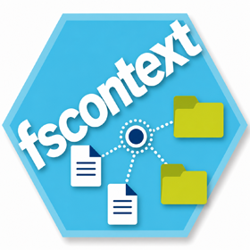

<!-- README.md is generated from README.Rmd. Please edit that file -->

# The fscontext R Package <a href='https://fscontext.dataobservatory.eu/'></a>

<!-- badges: start -->

[](https://github.com/dataobservatory-eu/fscontext/actions/workflows/rhub.yaml)
[](https://lifecycle.r-lib.org/articles/stages.html#experimental)
[](https://www.repostatus.org/#wip)
[](https://github.com/dataobservatory-eu/fscontext)
[](https://dataobservatory.eu/)
[](https://app.codecov.io/gh/dataobservatory-eu/fscontext)
<!-- badges: end -->

`fscontext` provides a provenance-aware contextual reconstruction
framework for file systems and related digital resource collections.

The package creates reproducible observational snapshots of files,
repository structures, and related operational resources, and supports
their contextual abstraction, semantic stabilization, and
reconstruction-oriented analysis.

Typical use cases include:

- computational workflow reconstruction
- provenance-aware research infrastructure
- contextual research corpora
- repository and Git-aware workflows
- temporal activity reconstruction
- duplicate and reuse detection
- archival and preservation-oriented analysis
- Heritage Digital Twin analytical workspaces
- forensic and audit workflows

## Core concepts

The package separates three complementary analytical layers:

| Layer | Purpose |
|----|----|
| observational | reproducible snapshots of observed digital resources, such as source files, document versions, born-digital photographs, scans, synchronized cloud folders, or repository working copies |
| contextual | contextual grouping of related resources into lightweight Record Sets, projects, collections, or reconstruction workspaces |
| analytical | derived interpretations, temporal comparisons, summaries, activity metrics, semantic stabilization, and reconstruction-oriented analysis |

The framework intentionally separates observational evidence, contextual
abstraction, semantic interpretation, and analytical reconstruction.
This layered design supports reproducible workflows while preserving the
distinction between:

- observed digital evidence,
- contextual organisation of related resources,
- and later analytical or professional archival interpretation.

In operational archival terms, observed files and digital objects may
later support the construction of contextual `Record Sets`, while still
remaining separate observed `Instantiations` of evolving digital
resources.

## Installation

``` r
# install.packages("pak")
pak::pak("Eviota/reporting")
```

``` r
library(fscontext)

snapshot <- scan_storage(
  root = file.path("D:", "wikibase-etl"),
  storage_id = "l480-ssd"
)

snapshot_context <- add_snapshot_context(snapshot)

record_set <- snapshot_context |>
  create_record_set(
    record_set_id = "repo_root",
    resource_id = "path_id",
    locator_path = "rel_root_path",
    construction_rule =
      "repository_context|repo_root",
    resource_type = "file"
  )
```

------------------------------------------------------------------------

## What this package does not do

The package does not:

- modify files
- reconstruct file contents
- infer authoritative archival hierarchy
- replace version control systems
- perform ontology-complete provenance modelling
- perform opaque AI inference

## Notes

- Large scans may require substantial time on slower or networked
  storage systems.
- Some files may be inaccessible due to permissions or synchronization
  state.
- Observational snapshots are intended for reproducible local or
  institutional analysis workflows.
- Contextual and analytical layers may evolve independently from the
  original observational corpus.

<!-- -->

<!-- -->
